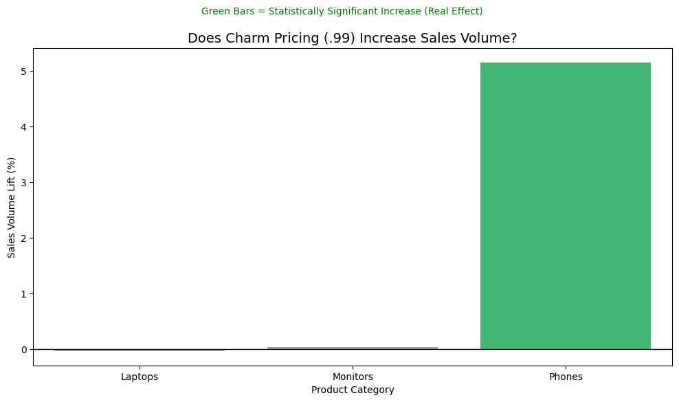

# The Left-Digit Bias Audit 
**Testing if $X.99 pricing actually works in E-Commerce**

**[View the Full Executive Report (PDF)](The_Left-Digit_Bias_Report.pdf)**

## Project Overview
Does pricing a product at **$19.99** instead of **$20.00** actually generate more sales? Or is it just marketing folklore?

This project uses **real sales data (185k+ transactions)** and **inferential statistics** to definitively answer: *Does "charm pricing" (ending prices in .99) significantly increase sales volume compared to round pricing (.00)?*

---

##  Research Question
**Primary Question:** Do products priced with .99 endings sell more units than products with round (.00) pricing?

**Hypotheses:**
- **H₀ (Null):** There is no significant difference in sales volume between .99 and .00 pricing.
- **H₁ (Alternative):** Prices ending in .99 have significantly higher sales volume.

---

##  Key Findings
**The Verdict: Charm Pricing WORKS... but only for Phones.** 📱

| Product Category | Sales Lift | Statistically Significant? |
| :--- | :--- | :--- |
| **Phones** | **+5.16%** | **YES** ($p < 0.001$) |
| Laptops | -0.04% | No |
| Monitors | +0.03% | No |

**Bottom Line:** Phones priced at $X.99 sell significantly more units than those priced at $X.00. However, for high-consideration purchases (Laptops), the effect disappears.

*(Note: Green bars indicate statistical significance at p < 0.05)*

---

##  Methodology

### 1. Data Preparation
- **Source:** [Electronic Sales Data (Kaggle)](https://www.kaggle.com/datasets/beekiran/sales-data-analysis)
- **Volume:** 185,950 cleaned transactions.
- **Feature Engineering:** - Parsed prices into **Charm** (.99) vs **Round** (.00).
  - Categorized products (Phones, Laptops, etc.) to ensure "apples-to-apples" comparison.

### 2. Statistical Testing
**Why Mann-Whitney U?**
- **Normality Check:** A Shapiro-Wilk test confirmed the data follows a **Power Law** (Pareto distribution), not a Bell Curve ($p < 0.05$).
- **The Solution:** Used the Mann-Whitney U test (Non-Parametric) instead of the T-Test to avoid errors caused by outliers.

### 3. Analysis by Category
We moved beyond aggregate averages to test specific product categories, revealing that **impulse purchases** (phones) are sensitive to pricing psychology, while **research-heavy purchases** (laptops) are not.

---

## Why This Matters

### For Businesses:
- **Strategy:** Stop losing margin on Laptops. Pricing a MacBook at $1999.99 vs $2000.00 yields **zero volume benefit**, so the company is voluntarily losing $0.01 per unit.
- **Opportunity:** Aggressively apply .99 pricing to Phones and Accessories to capture the ~5% volume lift.

### For Consumers:
- **Psychology:** You are statistically more likely to buy a phone at $599.99 than $600.00. The "left digit effect" is real—our brains anchor on the first number we see.

---

## Technical Details
- **Language:** Python 3.9+
- **Libraries:** Pandas (Data Manipulation), SciPy (Statistics), Seaborn (Visualization)
- **Report Generation:** LaTeX

## Study Limitations
- **Observational Data:** This is a historical audit, not a controlled A/B test.
- **Category Scope:** Results are specific to Electronics. Fashion or Grocery sectors may behave differently.
- **Seasonality:** The dataset is a single snapshot and may not capture seasonal buying shifts.

## What I Learned
1. **Statistical Rigor:** Just because data *looks* different doesn't mean it *is* different. P-values are essential for business credibility.
2. **Context is King:** Pricing strategies aren't universal. What works for a $500 phone doesn't work for a $1,500 laptop.
3. **Data Distribution:** Always check for Normality (Bell Curve) before choosing a test. Using a T-Test on this data would have led to false conclusions.

---
## License
This project is open source under the MIT License
